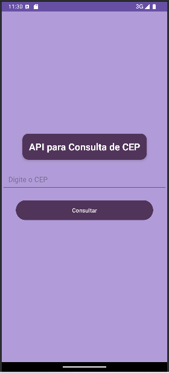
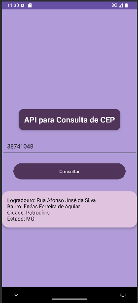

<h1 align="center">Consulta de CEP usando API</h1>

## Project
This application allows users to query address information based on a ZIP code (Postal Code). Using a public API, the app performs a search for the ZIP code provided by the user and returns data such as neighborhood, city, state, and other relevant information quickly and efficiently. The interface is simple and intuitive, offering an efficient user experience for querying ZIP codes from any location.
## Layout
<div align="center">
  
  
</div>

## Technologies Used
- *Programming Language:* Kotlin
- *Development Environment:* Android Studio

## Code Author
```kotlin
fun main() {
    println("Code by Marcela Geremias!")
}